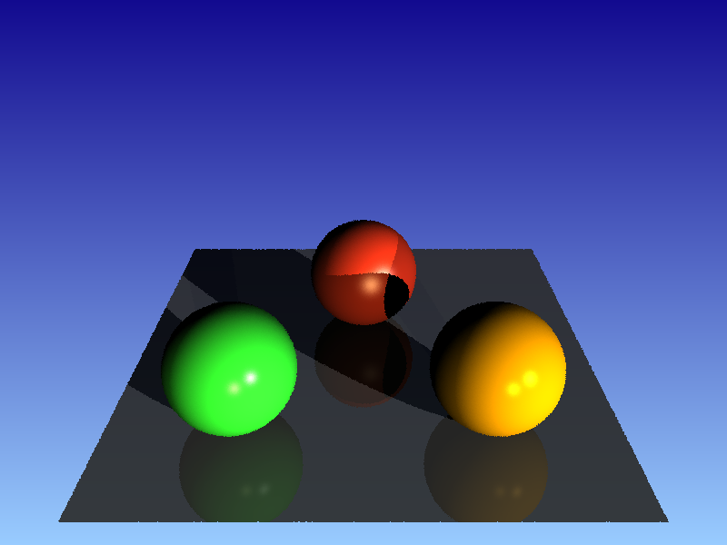
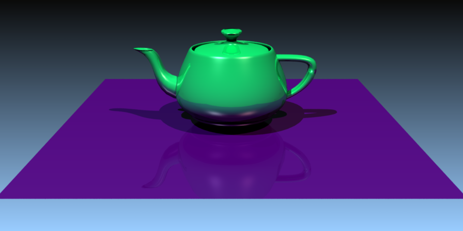
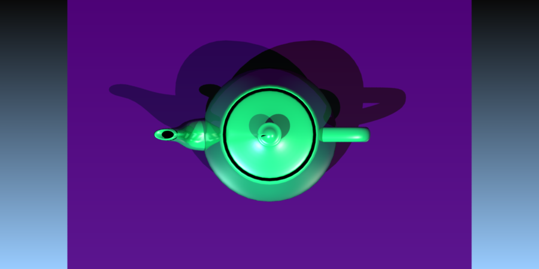

**COMPUTER GRAPHICS I (DIM0451) -- Ray Tracer Project**

# Project 06 - Triangular Meshes

## 1. Introduction

In this programming project you will add a new _object type_ to your ray tracer (RT), a [**triangular mesh**](https://en.wikipedia.org/wiki/Triangle_mesh). This new feature will enable your RT to create interesting scenes with object more complex than our humble sphere.

A triangle mesh is a data structure that holds information on a collection of triangles (_triangle soup_) that tries to approximate the external shell of [complex objects](https://en.wikipedia.org/wiki/List_of_common_3D_test_models). Triangles are the best choice for an individual component of a mesh because it is planar and only requires three vertices.

The first step in this project is to create the `Triangle` class derived from `Shape`. Rather than making your RT to accept individual triangles from a scene file, your RT should only accept meshes (collections of triangles). Why? Well, it does not make much sense to create a single triangle; usually the ultimate objective is to render complex scene with objects made of thousands of triangles. So, why bother make your RT read in a single triangle? Unless you are testing/debugging your RT, you will most probably want to read in thousands of triangles, i.e. a triangle mesh.

Therefore, the second step is to create the `TriangleMesh` class, which will actually hold the triangles data. Because the `TriangleMesh` is the true owner of the triangle data, and we do not want to replicate triangle data while instancing individual triangle objects (which should be a specification of the `Shape` class), the `Triangle` class will only hold the indices that make up an individual triangle and a reference (smart pointer) to the `TriangleMesh` object; when your RT need access to the triangle data it accesses the `TriangleMesh` pointer to retrieve all the information it needs. This means that all triangles that belong to a single object hold a reference to the same `TriangleMesh` object.

A triangle mesh might be described manually in a scene file or, preferably, read from an external file. In particular, your RT should be capable of reading triangle meshes from the [Wavefront .obj format](https://en.wikipedia.org/wiki/Wavefront_.obj_file#Vertex_texture_coordinate_indices), which is a three-dimensional (3D) geometry definition file format.

## 2. Requirements

### 2.1 The `Triangle` class

The `Triangle` class is derived from `Shape` and is the basic individual object that we need to instantiate. Remember that for the RT integrator to work we need to test each ray for intersection against the list of `Shape` objects that make the scene.

As stated before, triangle objects only hods references to the triangle data stored elsewhere, in a triangle mesh.
See the suggested `Triangle` class [here](trimesh/code/src/triangle.h).

To implement the intersection routine for a triangle, I recommend the paper:

- Tomas Möller and Ben Trumbore. 1997. [Fast, minimum storage ray-triangle intersection](https://dl.acm.org/citation.cfm?id=272315). _J. Graph. Tools_ 2, 1 (October 1997), 21-28. DOI=http://dx.doi.org/10.1080/10867651.1997.10487468
- Wikipedia reference [here](https://en.wikipedia.org/wiki/Möller–Trumbore_intersection_algorithm) for the same paper.
- Alternatively, you may want to follow the algorithm described in _"Section 4.4.2 Ray-Triangle Intersection"_ from the book **"Fundamentals of Computer Graphics"**, 4th ed., S. Marschner and P. Shirley, 2016.

### 2.2 The `TriangleMesh` class

In the Section 3 of the Chapter "_Surface Geometry_" available [**here**](https://graphicscodex.com/app/app.html) you will find the basic concepts related to a Triangle Mesh. There you will learn that the naïve way to store a triangle soup is to create a **triangle list**. As the name implies, it is a list of triangles where each individual triangle stores _all the data_ the application needs, such as 3D geometric coordinates, normals, and texture coordinates. The access is easy and fast, but we have unnecessary data replication, since most triangles usually share edges with other triangles. For example, if we have a vertex shared by, say, 4 triangles, that vertex information would be replicated 4 times, one for each individual triangle.

The second approach we examined was the **Indexed Triangle List**. Rather than storing each vertex data (geometry, normal, texture) in each individual vertex of a triangle, this approach tries to save memory by storing single lists of all data and making the triangles store only indices (references) to the vertices in those lists. The access is less direct, but we save a considerable amount of memory, since the vertex data is shared among all triangles.

You may want to implement `TriangleMesh` as a simple `struct`, since all members are public (to make access more efficient).
See the suggested `TriangleMesh` struct [here](trimesh/code/src/triangle.h).

<!--
```c++
 struct TriangleMesh {
	const int n_triangles; //!< # of triangles in the mesh.
	// The size of the three lists below should be 3 * nTriangles. Every 3 values we have a triangle.
	vector< int > vertex_indices; //!< The list of indices to the vertex list, for each individual triangle.
	vector< int > normal_indices; //!< The list of indices to the normals list, for each individual triangle.
	vector< int > uv_indices;     //!< The list of indices to the UV coord list, for each individual triangle.

	// Here comes the data associated with each vertex. WARNING: The length of the vectors below may differ.
	vector< Point3f > points;   //!< The 3D geometric coordinates
	vector< Normal3f > normals; //!< The 3D normals.
	vector< Point2f > uvs;      //!< The 2D texture coordinages (might be 3D, if necessary).

	// Regular constructor
	TriangleMesh( int n_tri, // The # of triangles also defines the length of each of the index lists.
	const int *v_indices,   // Index list of vertices.  The length of this list is 3 * n_tri.
	const int *n_indices,   // Index list of normals.   The length of this list is 3 * n_tri.
	const int *uv_indices,  // Index list of uv coords. The length of this list is 3 * n_tri.
	const Point3f *p,  int n_points,		  // List of vertices, and its corresponding length.
	const Nornal3f *n, int n_normals,		  // List of normals, and its corresponding length.
	const Point2f *uv, int n_uv_coords );     // LIst of UV coords, and its corresponding length.
};
```
-->

Here are an example of the interplay between the several `Triangle` objects and the single `TriangleMesh` object. Suppose you are coding the `Triangle::intersect()`. You will certainly need to access the triangle data, such as the vertex coordinates. All you code have to do is to access the mesh (via pointer) and retrieve the desired data based on the vertex indices, as shown below:

```cpp
// Inside Triangle::intersect()

// This is how we retrieve the information associated with this particular triangle.
const Point3f &p0 = mesh->points[v[0]]; // Get the 3D coordinate of the 0-vertex of this triangle.
const Point3f &p1 = mesh->points[v[1]]; // Same for the 1-vertex.
const Point3f &p2 = mesh->points[v[2]]; // Same for the 2-vertex.
// Let us retrieve the normals in the same way.
const Normal3f &n0 = mesh->normals[n[0]]; // Retrieve the normal at vertex 0.
const Normal3f &n1 = mesh->normals[n[1]]; // Retrieve the normal at vertex 1.
const Normal3f &n2 = mesh->normals[n[2]]; // Retrieve the normal at vertex 2.
// Same goes for the UV coords.
const Point2f &uv0 = mesh->uvs[uv[0]]; // Retrieve the uv coord at vertex 0.
const Point2f &uv1 = mesh->uvs[uv[1]]; // Retrieve the uv coord at vertex 1.
const Point2f &uv2 = mesh->uvs[uv[2]]; // Retrieve the uv coord at vertex 2.
```

I recommend the creation of an utility function `create_triangle_mesh()` that takes care of creating an underlying `TriangleMesh` as well as a `Triangle` for each triangle in the mesh. This function returns a vector of shared pointers to `Shape` (i.e. `Triangles`) as a result.
See the suggested `create_triangle_mesh()` function [here](trimesh/code/src/triangle.cpp).

<!--
```c++
vector<shared_ptr<Shape>>
create_triangle_mesh( bool reverse_orientation, // Request inverse the vertex orientation.
					  int n_triangles,          // Number of triangles.
					  const int *vertex_idx,    // List of triangle vertex indices.
					  const int *normal_idx,    // List of triangle normal indices.
					  const int *uvcoord_idx,   // List of triangle uv coord indices.
					  const Point3f *v,         // List of vertex points.
					  int n_vertices,           // Number of vertices.
					  const Normal3f *n,        // List of normals.
					  int n_normals,            // Number of normals.
					  const Point2f *uv         // List of uv coords.
					  int n_uvs                 // Number of uv coords.
					)
{
		// Create the mesh database.
		shared_ptr<TriangleMesh> mesh =
				make_shared<TriangleMesh>( n_triangles, vertex_idx, normal_idx, uvcoord_idx,
				v, n_vertices,  n, n_normals,  uv, n_uvs );

		// List of shapes (triangles) we need to return to the client.
		vector<shared_ptr<Shape>> tris;
		// Create the triangles, which are just references to the mesh database.
		for (int i = 0; i < n_triangles; ++i)
			tris.push_back(make_shared<Triangle>{reverse_orientation, mesh, i} );
		return tris;
}
```
-->

The overall procedure may be summarized as follows:

```
[1] The initial triangle mesh information is read from the scene file and stored in a `ParamSet` object.
[2] API calls the function `create_triangle_mesh_shape(const ParamSet &ps)`
[3] Inside `create_triangle_mesh_shape()`
	[3.1] Create a transient object of the type `TriangleMesh`, that will hold all the mesh data we need to create our triangles.
	[3.2-a] If "filename" has been set, it means we must read an OBJ file. Call `load_mesh_data()`
		  This function will fill in the `TriangleMesh` object for us.
		  This function calls the *tinyobjloader* functions to get the job done.
	[3.2-b] Else, it means we must extract all the `TriangleMesh` information from the ParamSet object, manually.
	[3.3] After gathering all the `TriangleMesh` data we need (either from an OBJ file or the scene file itself),
		  it is time to move this data into our internal permanent `TriangleMesh` data structure.
		  Call `create_triangle_mesh()`, which should return the list of triangle.
	[3.4] Return to the client the list of triangles created in [3.3].
```

### 2.3 The Barycentric Coordinates of the Ray-Triangle Intersection

After reading the suggested paper on ray-triangle intersection and understanding how to determine ray-triangle intersection, you will know that when we have a valid intersection, the routines calculates three values: the ray parameter `t`, and the two barycentric coordinates `u` and `v`, both in `[0,1]`. (Remember that the 3rd barycentric coordinate is `1-u-v`).

The barycentric coordinates may be used, for instance, to determine the interpolated normal at the exact intersection point inside the triangle. Remember that not necessarily we have the same normal for the entire triangle surface. In fact, this will seldom be the case. Often times we have different normal values at each triangle vertex, since they are a single piece on a large jigsaw (the triangle mesh). This leads to a smooth color interpolation along a surface composed of several triangles. The interpolation of normals along the triangle face is called [`Phong shading`](https://en.wikipedia.org/wiki/Phong_shading) (not to be mistaken with the Phong Reflection Model).

## 3. The Scene Format

Here are the two ways to declare a triangle mesh in your scene file. First, we have a direct manual declaration of a triangle mesh (no external file provided). This is done with the tag `object` inside the tag `scene`.

```xml
<RT3>
    <!-- Declaration of previous components ommited here -->
    <world_begin/>
	    <object type="trianglemesh" material="grey" ntriangles="2" indices="0 1 2   0 2 3"
		vertices="-3 -0.5 -3   3 -0.5 -3   3 -0.5 3  -3 -0.5 3"
		normals="0 1 0   0 1 0   0 1 0   0 1 0"
		uv="0 0   1 0   0 1   1 1"
		reverse_vertex_order="false"
		compute_normals="false"
		backface_cull="true"/>
        <!-- other scene stuff comes here -->
    <world_end/>
</RT3>
```

The meaning of each attribute is:

- `ntriangle`: Number of triangles in the mesh.
- `indices`: List of indices that make up each individual triangle. Every 3 integers, we have a triangle. Remember that all triangles must follow the same orientation, usually conterclockwise. These values should be stored in the `TriangleMesh::vertex_indices` vector.
- `vertices`: These are the 3D coordinates of each vertex. Every 3 sequential real values comprise a single vertex coordinate. These values should stores in `TriangleMesh::points`.
- `normals`: These are the 3D normal vectors for each vertex. They may not be normalised. Each 3 sequential real value completes a single normal data.
- `uv`: These are the 2D texture coordinates associated with each individual vertex. Every 2 real values we have a single texture coordinate.
- `reverse_vertex_order`: Asks RT3 to reverse the order of the vertices in a triangle, while determining the **front face**.
- `compute_normals`: Asks RT3 to compute a normal for each triangle, even if the normals are provided in the scene or OBJ file.
- `backface_cull`: Asks RT3 no to calculate color for the **backface** of the triangle---this is specially useful if we are reading a watertight geometry mesh.

Usually there are as many `normals` and `uv` values as there are `vertices` values, since they are often associated with each individual vertices. However, it is possible to have fewer `normals` than vertices. We may have a single normal defined for the entire triangle, which means the same normal for each triangle vertex.

The output of this scene is:



The second way to create a triangle mesh in your scene is to tell the ray tracer to read the data from a _.obj_ file.

```xml
<object type="trianglemesh" filename="../scene/teapot.obj"/>
```

The attribute `filename` contains the path + file name to the _.obj_ file.

In both cases, the triangle mesh is assigned a Blinn-Phong material manually. I understand that some _.obj_ files are accompanied with a _.mtl_ material file. However, in this project you don't need to process that file.

The output of this scene captured with a perspective camera is:



The same scene with an orthographics camera (top view):



## 4. Recommendations

Read all the supporting material posted on Sigaa. Try to implement the manual version of the triangle mesh first.

To read a triangle mesh from a file, I recommend that you study the example code available [here](trimesh/code) that relies on the [tinyobjloader](https://github.com/tinyobjloader/tinyobjloader) to read the mesh data from a '.OBJ' file.

If you do not like this approach, you will have to create your own routines. Perhaps you could try [this library](https://github.com/cemyuksel/cyCodeBase/) instead. All you need is the headers `cyPoint.h`, `cyTriMesh.h`, and `cyCore.h`. Try to create a test program just to get the hang of this lib before adding it to your main project.

Here are some scenes and object files:

- [A basic scene with three spheres resting on a plane.](./data/three_spheres)
- [A teapot on a plane.](./data/teapot_scene/teapot_scene.xml)
- [A obj file representing a plane.](./data/plane.obj)
- [A low-resolution version of the teapot object.](./data/teapot_scene/teapot-low.obj)
- [A high-resolution version of the teapot object.](./data/teapot_scene/teapot.obj)
