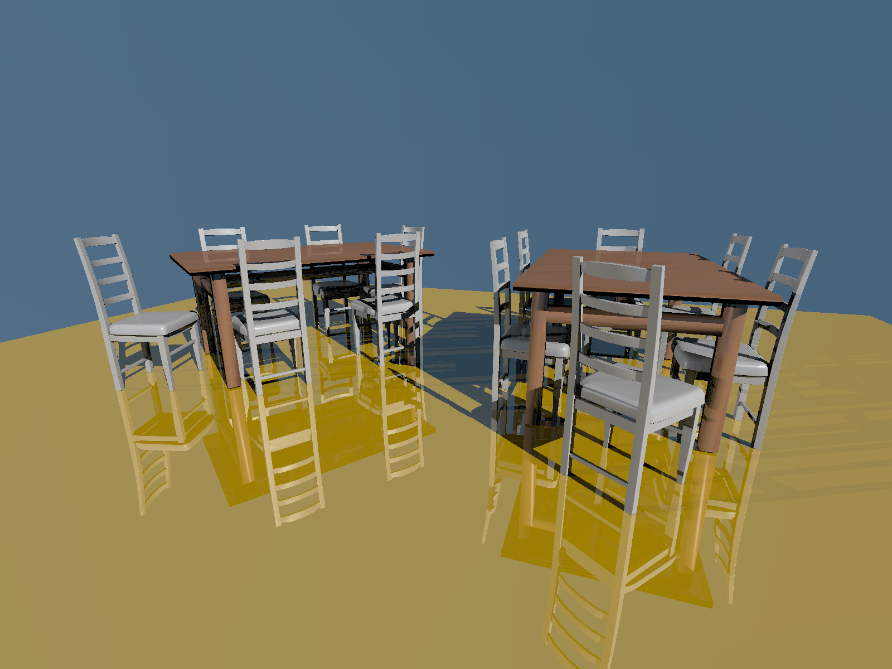

__COMPUTER GRAPHICS I (DIM0451) --  Ray Tracer Project__

# Project 08  - Transformations


## 1. Introduction

In this programming project you will improve your ray tracer (RT) to support **geometric transformations**, more precisely [**affine transformation**](https://en.wikipedia.org/wiki/Affine_transformation),  a special kind of linear transformation that preserve points,  straight lines, and planes.  This is an important aspect in any rendering system, responsible for enabling better scene modeling as well as [**geometric instancing**](https://en.wikipedia.org/wiki/Geometry_instancing).

In practical terms, this new feature will allow your scene to load and place a mesh or a basic object anywhere in the scene (_translation_), as well as change their size (_scale_), and align the same object to whatever reference you desire (_rotation_).

Geometric transformation combined with a good data structure also saves memory because you only need a single copy of a large mesh, say the Utah Teapot; to create any other copy  or _instance_ of the teapot in a different location, orientation, or size you just need to define a **composite transformation**, apply it the original teapot mesh, and _voilà_, you have another copy of the teapot spending only the memory required to store a 4x4 matrix of floats!

## 2. System Architecture

This project would require a somewhat major refactoring of the RT3 system because all shapes must now support geometric transformation so that we may move objects around in a scene and/or reshape them as we like. Before we introduce the new classes and changes that you'll be required to implemented we need to introduce some theoretical concepts that, hopefully, should help you understand why this refectoring is necessary.

Recall that the RT3 graphics API design follows the concept of [**retained mode**](https://en.wikipedia.org/wiki/Retained_mode), in which the API retains all the data related to a the scene (i.e. primitives and rendering properties)  the client wants to render. In this design any calls to an API  function only updates the _retained_ information in memory; it's only when the RT3 finds the `<world_end/>` tag the rendering process begins.

This means that the API needs to keep track of some rendering _states_ (as in a finite-state machine) that may affect the way an incoming object should be rendered. One of such states is the _Graphics State_, which is just a C++ struct that keeps track of information such as the _current active material_, the _current transformation matrix_, the _library of materials_, or simply a flag that indicates whether we need to _flip the normals_ of all objects that the API processes.


## 3. The Graphics State and the Current Matrix Transformation

The **Graphics State** and the **Current Matrix Transformation** are important devices to help managing complex scenes with hierarchical components that requires nested transformations to be applied to group of elements. They are explained next.

### 3.1 The Graphics State

The Graphics State (GS) represents a collection of "_machine state_" that RT3 keeps track while parsing the scene file.  For instance, if the parser finds a statement defining a red matte material, all the objects that follows that statement will be rendering in red matte style. If the user wishes to alter the material, he or she needs to add another material statement to the scene file, to replace the previous active material. The list of information stored in a GS are:

* a pointer to the current material
* a dictionary of named materials (_aka_ library of materials)
* a flag indicating whether we should reverse (flip) the normals of objects
* a flag indicating whether we need to clone the library of materials (more on this later on)
<!-- * the current matrix transformation (CTM) -->

For a API that follows the retained mode, it is important to support the ability to save/restore the current graphics state. The usual way of doing that is to store the GS in a stack data structure. This ability, in turn, makes it possible to support the creation of a hierarchical [**scene graph**](https://en.wikipedia.org/wiki/Scene_graph) of objects. 

A _scene graph_ is classical  tree-based (or graph-based) data structure in which the geometric transformation stored in a parent (root) node is automatically propagated to (or composed with) all its descendant nodes (leaves) transformations. This is useful, for instance, if we need to simulate a planet with, say, two moons: the transformation that affects the (root) planet must also affect the moons (leaves); on the other hand, each moon has its own individual transformation associated with. 

Another important function of the scene graph is to help save memory if coupled with [object instancing (OI)](https://en.wikipedia.org/wiki/Geometry_instancing). With object instancing instead of having the scene nodes store the complete object data mesh, they just store a transformation (3D matrix) and a simple pointer to the unique real object mesh (master copy), stored elsewhere in memory. Consider, for example, a scene with 10 copies of the [Stanford Dragon](http://graphics.stanford.edu/data/3Dscanrep/), whose mesh have approximately 5.5 million triangles. Without OI the scene would have required memory to stored 55 million of triangles! On the other hand, with OI all the dragons are simple (transformed) copies of the one dragon mesh.

### 3.2 Transformations and the CTM

The _Current Matrix Transformation_ (CTM) is a matrix that is kept through the parsing of a scene file. It affects all objects that rely on transformations to be defined, such as the camera, objects in general, and some types of lights. For instance, when the parser finds the camera-related `lookat` statement, the CTM defines the world-to-camera transformation that takes points or rays specified in the world frame to the camera frame. The CTM is reset to the _identity matrix_ whenever the parser finds the  `<identity/>`, or the `<world_begin/>` tags.


In the table below you find all statements that change the CTM, and the corresponding API functions.

| Scene file tag | API function call | Description |
|--|--|--|
| `<identity\>` | `API::identity()` | Set CTM to the identity matrix.
| `<translate value="dx dy dz"\>` | `API::translate()` | Compose CTM with a translation transformation matrix.
| `<scale value="sx sy sz"\>` | `API::scale()` | Compose CTM with a scale transformation matrix.
| `<rotate angle="value" axis="x y z"\>` | `API::rotate()` | Compose CTM with a rotation transformation matrix.
| `<lookat look_from="x y z" look_at="x y z" up="x y z"\>` | `API::look_at()` | Compose CTM with a look at (a combination of translation and change-of-frame) transformation matrix.
| `<save_coord_system name="cord_name"\>` | `API::save_coord_system()` | Stores in a dictionary data structure the CTM (data) associated with a name (key).
| `<restore_coord_system name="cord_name"\>` | `API::restore_coord_system()` | Set CTM to the transformation previously saved in a dictionary with the key "*coord_name*" (key)

Here goes a short list of other tags that support the manipulation of these rendering states:

* `<push_GS/> ... <pop_GS/>`: defines the limits of a block in which the entire **graphics state** information is saved (on a _stack_ data structure) at the beginning of  that block and restored at the end of it.
* `<push_CTM/>...<pop_CTM>`: defines the limits of a block in which a subset of the graphics state, namely the _current transformation matrix_ (CTM), is saved (also on a _stack_ data structure) at the beginning of the block and restored at the end of it.

### 3.3 Managing the GS and the CTM

Sometimes it is important to save information (the graphics state) at some point in the scene file and later on restore it. Let us consider an example to demonstrate the usefulness in saving the CTM. Suppose you want to model a dinner room scene that has a a table and six  chairs surrounding it --- this is a typical example of scene made of hierarchical components. After reading the table and chair models, it is necessary to scale, rotate and translate each chair in relation to the table coordinate system, so that the chair are located around the table.

Because the CTM is cumulative, each time the parser finds a transformation
statement, it multiplies the corresponding matrix with the the CTM. Therefore,
without a mechanism to save the CTM **before** the multiplication, we would
have to add another tranformation to reverse the CTM back to the state it was
before. So, if we had applied a `<translate value="0 0 10" />` to position one
chair, we would have to call a `<translate value-"0 0 -10" />` to go back to
the original CTM so that the next chair would be position in relation to the
(same) original reference and not the transformed reference frame (10 units
down the $Z$ axis). In other words, we have to "_reset_" the reference frame
every time we apply a transformation to a chair, so that we may define a new
transformation to position another chair. This way, all chair-related
transformations are defined based on the table's original reference frame. 

The CTM, or GS for that matter, are saved in a _stack_ data structure with the `<push_CTM/>`/`<push_GS/>` tags. The only difference between this two statements, is that the GS is a superset of the CTM, saving also information on all the materials and textures defines so far.

The scene below demonstrate the saving/restoring in action. The corresponding image follows.

```xml
<RT3>
    <lookat look_from="10 12 -30" look_at="0 2.5 0" up="0 1 0" />
    <camera type="perspective" fovy="75" /> 
    <accelerator type="bvh" split_method="equal" max_prims_per_node="4" />
    <!-- <accelerator type="list"/> -->
    <integrator type="blinn_phong" depth="3" />
    <film type="image" x_res="1600" y_res="1200" filename="../test_img/transformations/03_dinning_set_persp.png" img_type="png" />

    <!-- The Scene -->
    <include filename="../test_scene/transformations/03_dinning_set_geometry.xml" />
    <!-- The Scene -->
    <world_begin/>
        <!-- The Background -->
        <background type="colors" bl="0.1411 0.2313 0.333" tl="0.0078 0.1176 0.1882" tr="0.0978 0.1176 0.1882" br="0.1411 0.2313  0.333" />
        <!-- Lights -->
        <light_source type="directional" L="0.6 0.6 0.6" from="40 30 -30"/>
        <light_source type="directional" L="0.2 0.2 0.2" from="-30 5 -15"/>

        <make_named_material type="blinn" name="white" diffuse="0.95 0.95 0.95"  specular="1 1 1" mirror="0.09 0.09 0.09" glossiness="0" />
        <make_named_material type="blinn" name="gold" diffuse="1 0.65 0.0"  specular="0.8 0.6 0.2" mirror="0.4 0.4 0.4" glossiness="512"/>

        <named_material name="gold"/>
        <object type="trianglemesh" material="gold" ntriangles="2" indices="0 1 2 0 2 3"
            vertices="-40 0 30  40 0 30  40 0 -30  -40 0 -30"
            normals="0 1 0  0 1 0  0 1 0  0 1 0 "
            reverse_vertex_order="false"
            backface_cull="on"/>

        <object_instance_begin name="dinning_set" />
            <!-- The table -->
            <push_CTM/>
                <translate value="0 4.1 0" />
                <include filename="../test_scene/transformations/03_dinning_table.xml" />
            <pop_CTM/>
            <!-- Chair #1, at the head of the table -->
            <push_CTM/>
                <translate value="0 0 -11.2" />
                <rotate axis="0 1 0" angle="35.0"/>
                <include filename="../test_scene/transformations/03_dinning_chair.xml" />
            <pop_CTM/>
            <!-- Chair #2, at the tail end of the table -->
            <push_CTM/>
                <rotate axis="0 1 0" angle="180.0"/>
                <translate value="0 0 -8.2" />
                <include filename="../test_scene/transformations/03_dinning_chair.xml" />
            <pop_CTM/>
            <!-- Chair #3, first chair on the right, next to the head of the table -->
            <push_CTM/>
                <rotate axis="0 1 0" angle="-90.0"/>
                <translate value="-4.5 0 -5.2" />
                <include filename="../test_scene/transformations/03_dinning_chair.xml" />
            <pop_CTM/>
            <!-- Chair #4, second chair on the right, next to the tail end of the table -->
            <push_CTM/>
                <rotate axis="0 1 0" angle="-90.0"/>
                <translate value="4.5 0 -5.2" />
                <include filename="../test_scene/transformations/03_dinning_chair.xml" />
            <pop_CTM/>
            <!-- Chair #5, first chair on the left, next to the head of the table -->
            <push_CTM/>
                <rotate axis="0 1 0" angle="90.0"/>
                <translate value="4.5 0 -5.2" />
                <include filename="../test_scene/transformations/03_dinning_chair.xml" />
            <pop_CTM/>
            <!-- Chair #6, second chair on the left, next to the tail end of the table -->
            <push_CTM/>
                <rotate axis="0 1 0" angle="90.0"/>
                <translate value="-4.5 0 -5.2" />
                <include filename="../test_scene/transformations/03_dinning_chair.xml" />
            <pop_CTM/>
        <object_instance_end/>

        <!-- Positioning Dinning set #1 -->
        <push_GS/>
            <translate value="12 0 0 " />
            <object_instance_call name="dinning_set" />
        <pop_GS/>
        <!-- Positioning Dinning set #2 -->
        <push_GS/>
            <translate value="-12 0 0 " />
            <rotate axis="0 1 0" angle="35.0"/>
            <object_instance_call name="dinning_set" />
        <pop_GS/>
        
    <world_end/>
</RT3>
```



This summarises the CG and CTM managing statements.

| Scene file tag | API function call | Description |
|--|--|--|
| `<push_GS\>` | `API::push_GS()` | Saves the current GS on a stack.
| `<pop_GS\>` | `API::pop_GS()` | Overwrite the current GS with the one saved on the top of the GS stack.
| `<push_CTM\>` | `API::push_CTM()` | Saves the current TM on a stack.
| `<pop_CTM\>` | `API::pop_CTM()` | Overwrite the current TM with the one saved on the top of the TM stack.


## 4. New classes

Here is a list of new classes you'll need to create to support geometric transformations:

+ `Matrix4x4`: a class that implements a $4\times 4$ matrix and its operations, such as multiplication, transpose, and inverse.
+ `Transform`: a class that represents a linear affine transformation (geometric transformation). This class internally stores a transformation matrix and its inverse. This class also supports a set of operations that basically applies the transformation to various RT3 objects, such as a point, vector, normal, ray, bounding box, surfel, or even another `Transformation` object, stored as a $4 \times 4$ matrix and a set of operations on this matrix.


Have a look at the PBR's way of creating the `Transform` class [here](https://www.pbr-book.org/3ed-2018/Geometry_and_Transformations/Transformations). You will also find the math support to handle the operations on a $4\times 4$ matrix there.

### 4.1 Changes to the current data structures
Here goes a suggestion on how to create the objects that will support the overall rendering state management.
```cpp
struct GraphicsState {
	shared_ptr< Material > curr_material;  //!< Current material that globally affects all objects.
	bool flip_normals{false};              //!< When true, we flip the normals
	using DictOfMat = Dictionary< string, shared_ptr<Material> >;
	shared_ptr< DictOfMat > mats_lib;      //!< Library of materials.
	bool mats_lib_cloned{false};           //!< We only actually clone the library if a new material is added to it.
};
class API {
	...
	/// The Current Transformation Matrix
	static Transform curr_TM;
	/// Named coordinate systems dictionary
	static Dictionary< string, Transform > named_coord_system;
	/// The current GraphicsState
	static GraphicsState curr_GS;
	/// The stack of GraphicsState, activate by the tags `<pushGS/>...<popGS/>`
	static stack< GraphicsState > saved_GS; // Recall that the GS includes the curent transformation.
	/// The stack of transformations, activate by the tags `<pushTM/>...<popTM/>`
	static stack< Transform > saved_TM;
   /* --------------------------------------------------------------------------------
	* The matrix lookup is unique map (hash table) of transformation matrices.
	* Every new transformation that is created in `API::transform()`
	* should be stored in this map.
	* So, whenever we generate a transformation matrix (either defined
	* directly in the scene file or as a result of composition of other
	* matrices), we do the following: we look it up in the dictionary;
	* if it's there, we return the shared pointer stored in the map;
	* if it's NOT there yet, we store it in the dictionary and return
	* the shared pointer stored in the map.
	* -------------------------------------------------------------------------------- */
	/// The Dictionary of instantiated transformation matrix.
	static Dictionary< string, shared_ptr< const Transform > > transformation_cache;
	...
};
```
In the `Shape` class, now we should have these new members:
```cpp
    // === Shape Public Data
    const Transform * obj_to_world; //!< Object to World transformation (scene specified).
    const Transform * world_to_obj; //!< World to Object trasformation (deduced base on O2W).
    const bool flip_normals;
```
these should be filled in with information passed up via constructor, which
comes from all the derived classes, such as `Sphere`, `Triangle`, etc.  So, you
may ask "_where do I get these transformations from?_" there are the
transformation stored in the CTM and its inverse. Don't forget to store them in
the `transformation_cache` if they are not already stored there. This is
important to save memory.

### 4.2 What happens when you...

1. find a `<translate value="dx dy dz"\>` (or any other transformation tag, for that matter) tag in a scene?
    + you call the `rt3::translate()` function that returns a `Transformation`
    object, which contains both the corresponding transformation $4 \times4$
    matrix and its inverse, and multiplies that into the CTM: 
	+ `curr_TM = curr_TM * rt3::translate( delta );`
2. find an object, such as `sphere` tag, in a scene?
	+ you will get the CTM, and its inverse, and store them into the `transformation_cache` and pass down the pointers to these objects to the function that creates the objects `make_object(...)`.
3. find a either `<push_CTM\>`tags?
	+ you push the CTM into the correspoding stack.
4. find a `<push_GS\>` tag?
	+ you push the GS into its correspoding stack and to the same with the CTM.
5. find a `<pop_CTM\>` tag?
	+ you pop off (and retrieve) the top `Transform` object from the `saved_TM` stack and overwrites the CTM.
6. need to calculate the intersection of a viewing ray (camera's ray) with a transformed object?
	+ at the beginning of the intersection function you **transform** the ray (not the object!) by applying the `world_to_obj` transformation to the ray (this is done with the `Ray operator()(const Ray&)` method of the `Transform` class). Recall that this is the inverse `Transform` object that you stored inside the shape when you loaded the shape into memory. This transformation you bring the ray from the _world's coordinate system_ into the _object's coordinate system_ so that the intersection is calculated under the same _coordinate frame_.
7. find a `<make_named_material ... \>` tag?
	+ you create the new material (based on the information stored in the `ParamSet` object), look for it into the `curr_GS.mats_lib` library and (1) if the material **is** already there, it means you need to update it and you're done; (2) if that material **is not** already stored in the library, it means you need to store it into the library. But, in the latter case, before inserting the **new** `Material` object into the library, you need to check whether the library has not already been cloned (check the `mats_lib_cloned` flag): if it's not been cloned, then you clone the library, turn on the flag and then you store the material into the (cloned) `curr_GS.mats_lib` dictionary.
	
<!--
## 5. Object Instancing

If you want to support _object instancing_ (optional) you will need to modify the `RenderOptions` struct to add the following:
```c++
struct RenderOptions{
...
	/// list of primitives
	using PrimVec = vector< shared_ptr< Primitive > >;
	PrimVec primitives;
	/// Dictionary of (object) instances
	Dictionary< string, PrimVec > obj_instances;
	PrimVec *curr_instance{ nullptr };
...
};
```
You will also need to create a new class:
+ `TransformedPrimitive`: it's a classe derived from `Primitive`This class injects an additional transformation matrix between the primitive’s notion of world space and the actual scene world space.
+ -->

## 6. Requirements

You should support, at least, **translation**, **rotation** (around any axis), and **scale** of object in the scene.


## 7. Recommendations

For a more theoretical understanding, read Chapter 6, from _"Fundamentals of Computer Graphics"_, 4th ed., by Marschner and Shirley.

For a more practical point of view, read Chapter 2, specially Section "_2.7 - Transformations_" of the "Physically Based Rendering", 3rd ed, by Pharr, Jakob, and Humphreys.

If your transformation works correctly, you should be able to generate a scene where we have the [Stanford's Chinese Dragon](https://casual-effects.com/data/) drinking tea straight from the [Utah Teapot](https://casual-effects.com/data/). Because these two meshes are define in a (completely different) coordinate systems of their own, you must rely heavily on transformation to render them together in the same approximate size, as well as to position and rotate them as desired.
